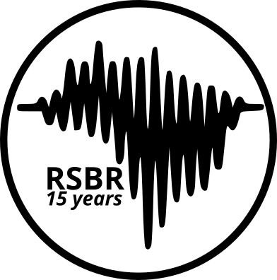

% RSBR_15_years documentation master file, created by
% sphinx-quickstart on Wed Apr 16 16:36:13 2025.
% You can adapt this file completely to your liking, but it should at least
% contain the root `toctree` directive.

Welcome to RSBR 15 years's documentation!
=========================================

<span style="display:block;text-align:center">

This repository contains reproducible material for the study "15 years of the Brazilian Seismographic Network: Data quality and Current Status" by Diogo Luiz de Oliveira Coelho, Gilberto da Silva Leite Neto,Sergio Luiz Fontes, submitted to ....

For further info, check out {doc}`usage`.
Read installation instructions in {ref}`Installation` topic.

```{warning}
The code is still experimental (under heavy development) so you should regularly check for (and pull) updates.

```

```{toctree}
:caption: 'Contents:'
:maxdepth: 1

whatis
usage
fetching
method
usefulfunction
requirements
todolist
references
```